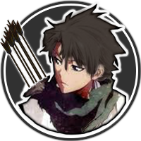

# 🛡️ RPG Survival Game

  
  
  

*Survive, explore and conquer a procedurally generated hostile world.*

---

## 🎮 Introduction

The objective of the game is simple: **survive in a hostile world**. To succeed, you will need to fight, collect resources, trade to get the best equipment, and gain experience. 

You start safely inside your village walls, surrounded by villagers who can help you on your journey. But once you step outside, the wild world is dangerous. Explore your surroundings, meet creatures like goblins, ogres, and wolves, and be curious—exploration is the key to your success!

---

## 🗺️ Key Features

* **RPG Mechanics:** Fight, trade, craft, and level up your character.
* **Procedural Generation:** The world map surrounding your central village is randomly generated.
* **Dynamic Cycle:** Sleep in your house to trigger a brand-new day, resetting and changing the world around you. 
* **Character Classes:** Choose your path between different archetypes (Swordman, Archer, Wizard).

---

## 📥 Downloads & Resources

If you are interested in downloading the source code and modify it, you can access the resource package here:
👉 **[Google Drive - Project Resources](https://drive.google.com/drive/folders/16_HV_IfVu2a9XO24dE5iqd_bw9zmMT1e?usp=drive_link)**

---

## 📸 Preview

  
  
   
  
  

