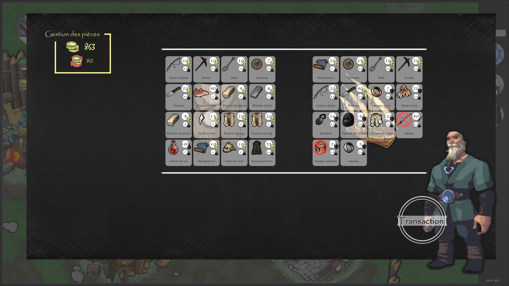
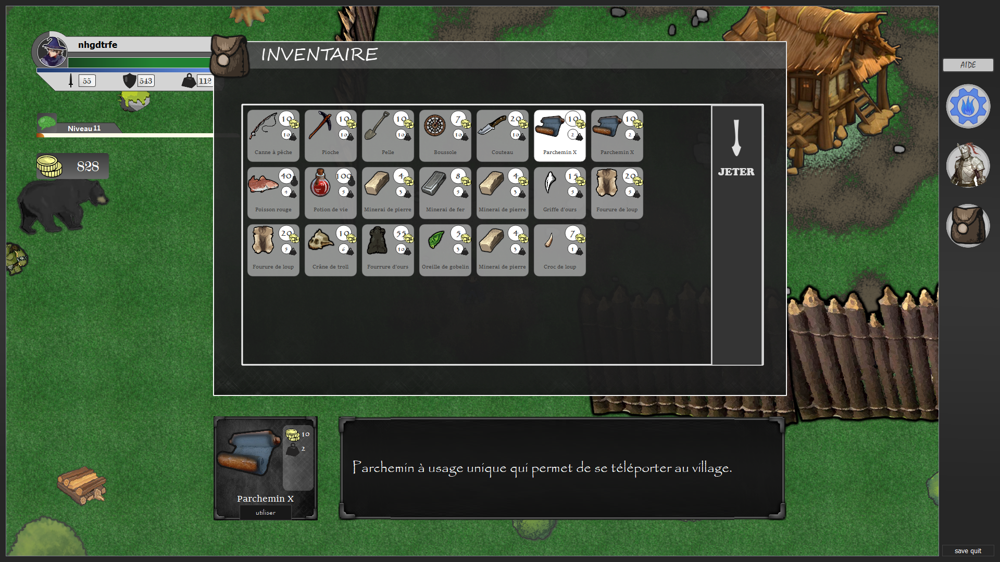

<h1>Description</h1>

<ul>
<li>Creator : BRUNE Adrien</li>
<li>Version : 1.0.0</li>
<li>Date : 20/02/2021</li>
</ul>

## Introduction

The point of the game is to survivre in an hostil world. To succeed, you will have to fight, collect, trade to gather the best equipment and gain experiences. You spawn in your village with villagers that could help you in your trip. You are safe inside the walls of the village, but outside it is wild and dangerous. Explore the world and meet goblins, oggres or wolves. Exploring the world will take a big part in your succes, so take time to be curious.

## More information

This games has a lot of similarities with an rpg game. The village is in a center of the map and the environment is radom. By sleeping in your house you will see that everything around will change, it is a new day afterall. So don't hesitate to sleep if you feel like everything has been done !

If you're interrested in dowloading the source code of the game, you can find the ressource package on this link :
<ul>
<li>https://drive.google.com/drive/folders/1XwgkAGBeUpI0Te7uagGC7-DUQdb85R_J?usp=sharing</li>
</ul>

## Preview

